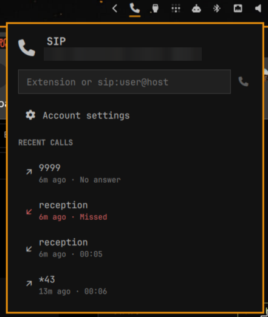
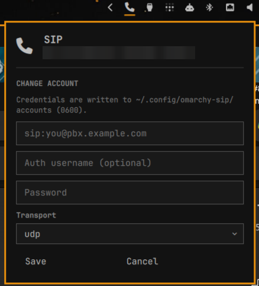

# Simple SIP

A minimal SIP softphone for the Omarchy bar. One account, one call at a time:
register, dial out, answer what comes in. [baresip](https://github.com/baresip/baresip)
does all the SIP, RTP and audio work.



```
  registered, idle            ringing (blinking, urgent colour)
  in a call                   dimmed: no account / daemon stopped
```

## Requirements

- `baresip` — `sudo pacman -S baresip` (in the official Arch repos)
- `python-jeepney` — `sudo pacman -S python-jeepney` (official repos; 450 KiB, pure
  Python, and its only dependency is `python` itself). The control helper speaks
  D-Bus to baresip; jeepney is the client library.
- PipeWire's PulseAudio interface (`pipewire-pulse`), which Omarchy ships by default
- `python3` for the control helper — stdlib plus jeepney, no pip packages and no
  build step

## Install

```bash
omarchy plugin add https://github.com/<you>/omarchy-simple-sip --enable
~/.config/omarchy/plugins/io.github.17xande.simple-sip/bin/omarchy-sip install
```

`install` generates the baresip config, writes a `systemd --user` unit and starts it.
The daemon holds the SIP registration continuously, so calls arrive even when the
panel is closed and across shell restarts.

Then set your account — either in the panel (the setup form appears until an account
exists) or from a terminal, which keeps the password out of your shell history:



```bash
read -rs PASSWORD
printf '%s' "$PASSWORD" | omarchy-sip account set sip:you@pbx.example.com \
    --auth-user you --transport tls
unset PASSWORD
```

## Using it

| Action | Panel | Keyboard | IPC |
|---|---|---|---|
| Call | type an extension or `sip:user@host`, press Enter | — | `omarchy-shell io.github.17xande.simple-sip dial sip:1001@pbx` |
| Answer | click **Answer** | `a` | `omarchy-shell io.github.17xande.simple-sip answer` |
| Reject / hang up | click **Reject** / **Hang up** | `d` / `b` | `omarchy-shell io.github.17xande.simple-sip hangup` |
| Account settings | click the gear row | `s` | — |

A bare extension or phone number is completed with your account's domain, so `1001`
dials `sip:1001@pbx.example.com`. Incoming calls raise a critical-urgency
notification and (by default) open the panel.

### Recent calls

The panel keeps a short log of calls made, received and missed. An inbound call that
never reached "established" is a **miss** (shown in the urgent colour); an outbound one
that was never picked up is just "No answer". Selecting a row redials it, with the
mouse or the keyboard.

The log is written by the daemon, not the panel, so a call that starts and ends while
the shell is restarting is still recorded. It lives in
`~/.config/omarchy-sip/history.jsonl` (mode `0600`, last 50 calls), and
`historyLimit: 0` in the widget settings hides the section entirely.

### Keybindings

Omarchy plugins cannot ship keybindings — the manifest has no such field, and
installing a plugin never writes to your Hyprland config. Add what you want to
`~/.config/hypr/bindings.conf`:

```
bindd = SUPER SHIFT, T, SIP dialer, exec, omarchy-shell io.github.17xande.simple-sip toggle
bindd = SUPER, F9, Answer SIP call, exec, omarchy-shell io.github.17xande.simple-sip answer
bindd = SUPER SHIFT, F9, Hang up SIP call, exec, omarchy-shell io.github.17xande.simple-sip hangup
```

`SUPER+SHIFT+T` is unbound in a default Omarchy install. Note that `SUPER+SHIFT+P`
is **not** free — Omarchy binds it to Google Photos.

## How it works

The daemon drives baresip over the **session D-Bus** (baresip's `ctrl_dbus` module,
`com.github.Baresip` at `/baresip`) and re-exports that control surface on one unix
socket, which is what everything else talks to:

```
$XDG_RUNTIME_DIR/omarchy-sip/control   one JSON object per line, both directions
```

Clients connect, write commands, and read the event stream back. Every baresip
event and every command response is broadcast to every connected client, so any
number of readers see the whole picture. The panel drives its state from *events*
(structured); the `status` snapshot exists only to resync after a shell restart,
when the last registration event may be minutes old.

D-Bus rather than baresip's `ctrl_tcp` is a deliberate security choice, covered
under [Security notes](#the-control-plane). A socket rather than a FIFO plus an
on-disk journal is another: nothing persistent has to be reopened by name to move a
message, which
removes the substitution and truncation races that come with re-resolving a
pathname in a directory other local processes can write to.

```
Panel.qml ──── Socket: $XDG_RUNTIME_DIR/omarchy-sip/control
                                    │
                          omarchy-sip daemon
                                    │ session D-Bus (com.github.Baresip)
                                 baresip ── SIP / RTP / audio
```

`Model.js` holds every pure function (event mapping, URI completion, duration
formatting, and the one place that scrapes baresip's prose output). `Service.qml`
owns state and processes. `Panel.qml` is a view with no call state of its own.

**Swapping the engine.** The QML only ever calls
`omarchy-sip {events,status,dial,answer,hangup,account}` with JSON in and out.
Replacing baresip with something else means reimplementing that contract; the QML
does not change.

## CLI

```
omarchy-sip install | uninstall            set up or remove the user service
omarchy-sip start | stop | restart         control the daemon
omarchy-sip status                         JSON: unit, account and baresip state
omarchy-sip events                         stream the JSON event feed
omarchy-sip dial <uri> | answer | hangup   call control
omarchy-sip send <cmd> [params]            any baresip command, fire-and-forget
omarchy-sip cmd  <cmd> [params]            ... and print the response
omarchy-sip history [--limit N]            recent calls as JSON
omarchy-sip account show | set | clear     account management
```

`send`/`cmd` reach every baresip command, which is handy for things the panel does
not surface: `omarchy-sip cmd callstat`, `omarchy-sip cmd reginfo`,
`omarchy-sip cmd listcalls`.

Environment overrides: `OMARCHY_SIP_CONF` (config dir, default
`~/.config/omarchy-sip`) and `OMARCHY_SIP_LISTEN` (SIP bind address, default
`0.0.0.0:0` — set a fixed port only if your PBX requires one).

## Security notes

- Credentials live in `~/.config/omarchy-sip/accounts`, mode `0600`. baresip's
  accounts format is `;`-delimited, so a password containing `;` is rejected rather
  than silently truncated.
- Passwords are passed to the CLI on **stdin**, never as an argument, so they never
  appear in a process listing.

### The control plane

baresip is driven over the **session D-Bus**, and `ctrl_tcp` is deliberately not
loaded. `ctrl_tcp` is an unauthenticated TCP listener on loopback, which means it is
reachable by every *other user* on the machine, not just you — and its connect
handler drops the existing client whenever a new one arrives, so any local process
could evict this daemon and take over the registered SIP account without racing
anything. There is no way to authenticate it.

The session bus has the properties ctrl_tcp lacks. Its socket lives in
`$XDG_RUNTIME_DIR`, mode 0700, so it is unreachable across uids at the filesystem
layer, and `dbus-daemon` authenticates every client with `SO_PEERCRED` (EXTERNAL
auth) rather than trusting whoever connects. The daemon refuses to start if
`com.github.Baresip` is already owned, rather than driving somebody else's baresip.

The plugin's own control socket is checked the same way: it is 0600 inside a 0700
pinned directory, and `accept()` additionally reads `SO_PEERCRED` and refuses any
client that is not this uid — asking the kernel who is on the other end rather than
inferring it from the permissions of a pathname.

Within your own session, any process you run can still place calls, exactly as it
can read your files. That is the same boundary every other Omarchy plugin has.
- Like all Omarchy plugins, this runs unsandboxed inside the long-lived
  `omarchy-shell` process, with your user's permissions.

### Directories and descriptors

Both directories the plugin owns — `~/.config/omarchy-sip` and
`$XDG_RUNTIME_DIR/omarchy-sip` — are *pinned*. The path is walked from `/` one
component at a time, each component opened with `O_DIRECTORY | O_NOFOLLOW` relative
to the descriptor of the one above it and checked for ownership, and the leaf
descriptor is then held for the life of the process. Everything afterwards is
opened relative to that descriptor by basename.

This matters because validating a *name* and reopening it later is not enough: a
process running as you can replace an intermediate directory in between, and a
final-component `O_NOFOLLOW` will not notice that the directory underneath changed.
A held descriptor refers to the directory *inode*, so it keeps resolving to the same
place no matter what happens to the names above it.

Each file is then opened with `O_NOFOLLOW | O_NONBLOCK | O_NOCTTY` and validated with
`fstat` **on the descriptor that will actually be used**, for type and owner.
Checking the descriptor rather than the pathname is what makes the check unraceable,
and `O_NONBLOCK` is what stops a FIFO substituted for a regular file from parking a
helper inside `open()`.

`~/.config/systemd/user` gets the same treatment — the unit file is created and
removed relative to a pinned descriptor, never by pathname. Its *mode*, though, is
left exactly as found: that directory is systemd's, not this plugin's, and forcing a
mode on it would silently widen a private one. Only the two directories the plugin
owns have their mode enforced, and only downwards.

### Writes replace, they never truncate

`O_NOFOLLOW` refuses a symlink but not a same-owner **hard link**. Opening
`accounts` with `O_TRUNC` would push your SIP password straight into whatever a
planted link points at, before any check could reject it. So a destination is never
opened for writing. Instead a fresh file is created under the pinned directory
descriptor with `O_CREAT | O_EXCL` and an unpredictable name — `O_EXCL` guarantees a
brand-new inode with no pre-existing links — written, `fsync`ed, revalidated on the
still-open write descriptor, and moved into place with `renameat`. A planted hard
link keeps the old bytes; a planted symlink is replaced and its target untouched.

### Ceilings

Nothing is read without one: whole-file reads cap at 1 MiB, one event record or
command line at 64 KiB, one history field at 512 bytes, 200 history records, and
baresip's prose replies at 8 KiB before they are spliced into `omarchy-sip status`.
An oversized record is dropped and the stream resynchronises at the next newline
rather than buffering. A client that never sends a newline cannot grow the daemon's
memory, and one that stops reading is disconnected rather than buffered forever.

### Processes

The QML side consumes each helper's diagnostic output a line at a time into a
240-character buffer instead of retaining whole streams, and every finite CLI call
has a whole-process deadline (10–20 s) after which the child is terminated. The
control socket is the one long-lived connection, and it is bounded by the per-record
cap rather than by a deadline.

### Limits of all this

A process already running as your user can do anything you can do; none of the above
is a boundary against *you*. What it defends is the narrower and more realistic case
of a confused deputy — something that can create a file or a link in one of these
directories persuading the daemon to read, write, or block on the wrong object.

One gap is structural and worth naming. Quickshell's `Socket` takes a `path`, not a
descriptor, so the **panel** connects to `$XDG_RUNTIME_DIR/omarchy-sip/control` by
pathname and cannot pin the directory the way the daemon does. A process that won a
race on that directory could stand up a decoy socket and the panel would talk to it.
Nothing secret crosses that socket — the SIP password only ever travels on the CLI's
stdin — so the reachable effect is spoofed call events in the panel and dial commands
that go nowhere. The daemon side, which is where the credentials and the persistent
state live, is pinned.

### Privileges

The plugin never invokes `sudo` and never calls a package manager. `pacman -S baresip`
in [Requirements](#requirements) is an instruction for you to run. `systemctl` is only
ever called as `systemctl --user` and only ever names this plugin's own unit,
`omarchy-sip.service`.

## Not in this version

- No mute — baresip's `menu` module exposes no mute command, so it would mean
  muting the system input device instead of just the call.
- No DTMF keypad, no multiple accounts, no call transfer or hold.
- Direct IP-to-IP calls need a reachable interface; baresip refuses loopback
  destinations with `no laddr for 127.0.0.1`.

## Troubleshooting

```bash
systemctl --user status omarchy-sip      # is the daemon up?
omarchy-sip status                       # what does it think is going on?
omarchy-sip events                       # watch calls happen live
cat $XDG_RUNTIME_DIR/omarchy-sip/baresip.log
qs log -p /usr/share/omarchy/shell --tail 100    # QML errors
```

If the daemon refuses to start with *"com.github.Baresip is already owned"*,
another baresip is running and exporting the control interface; the daemon
deliberately will not adopt it. Find it with
`busctl --user status com.github.Baresip`.

## Hacking on it

`.qml` edits hot-reload *into new instances*, but a bar widget already on the bar
keeps running the code it was created with — `omarchy-shell shell rescanPlugins`
will happily report "reloading" while the live widget carries on unchanged. Run
`omarchy-restart-shell` after touching `Service.qml` or `Panel.qml` if the change
does not seem to take. **`Model.js` edits never hot-reload** — the QML engine caches JS
imports for the life of the shell process, and neither `omarchy-shell shell
rescanPlugins` nor disabling/re-enabling the plugin clears them. Run
`omarchy-restart-shell` after touching `Model.js` (not `omarchy-refresh-shell`,
which also resets `shell.json` to defaults).

`Model.js` is deliberately free of QML objects, so its logic can be exercised
straight from node:

```bash
node -e 'const s=require("fs").readFileSync("Model.js","utf8");const M={};
new Function("exports",s+"\nObject.assign(exports,{normalizeTarget,parseReginfo});")(M);
console.log(M.normalizeTarget("1001","sip:you@pbx.example.com"));'
```

### Tests

```bash
./tests/run
```

Three dependency-free suites: `tests/model_test.js` covers every pure function in
`Model.js` (event mapping, URI completion, the registration-status scraping, relative
times), `tests/tracker_test.py` covers the call log's made / received / missed
classification, interleaved calls, the size cap and file permissions, and
`tests/io_test.py` covers the file/descriptor discipline described under
[Security notes](#directories-and-descriptors) — each case swaps a symlink, a FIFO,
an intermediate directory or a hard link in for something the plugin expects to own,
and asserts it fails, clips, or lands on the pinned object rather than following,
blocking, or buffering without limit.

`qmllint` cannot resolve the shell's `Panel` type and exits 255 with no output on
this plugin *and* on the first-party ones, so it is not a useful gate here.

## License

MIT
