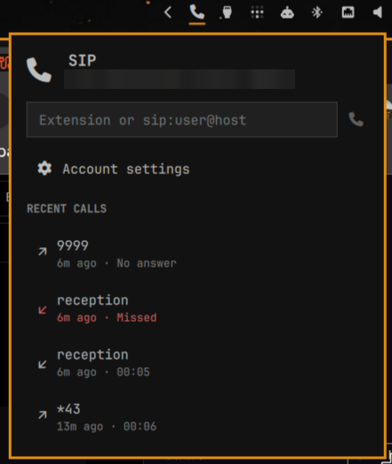
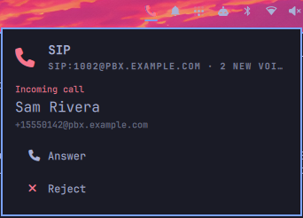
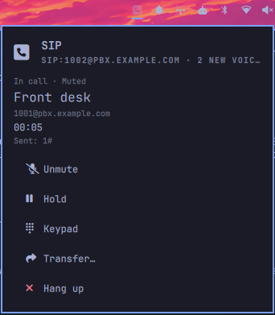
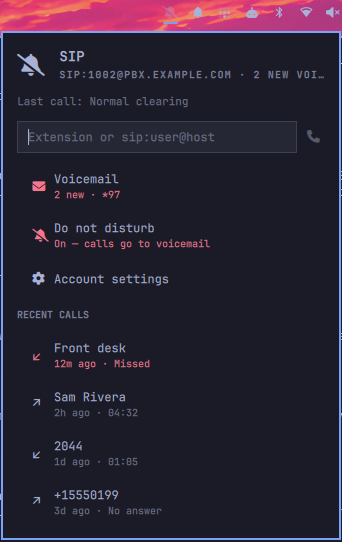
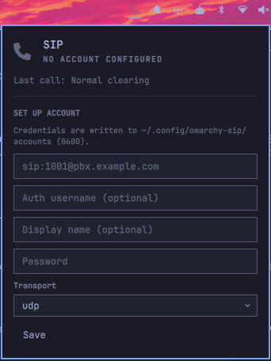
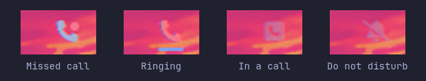

# Simple SIP

A SIP softphone that lives in the [Omarchy](https://omarchy.org) bar. Register one
account, call out, answer what comes in, and never leave the keyboard.
[baresip](https://github.com/baresip/baresip) does the SIP, RTP and audio; a small,
heavily fenced helper drives it; the panel follows your theme.


<p align="center">
  
</p>

| A call coming in | In a call |
|---|---|
|  |  |
| **Do not disturb** | **Setting up an account** |
|  |  |

<p align="center">
  
</p>

<sub>Every name and number in these screenshots is dummy `example.com` data.</sub>

## Why

A desk phone or a softphone window is one more thing to keep open, and neither
knows about your desktop. This puts the phone where the rest of Omarchy lives: a
glance at the bar says whether you are registered, whether you missed a call and
whether there is voicemail; a call opens the panel with Answer under your hand, and
the whole thing works from the keyboard.

## Features

- **Call, answer, reject** — type an extension, a number or a `sip:` address, or
  pick a contact as you type. Incoming calls open the panel and ring with a real
  double-ring, not baresip's recorded voice.
- **In-call controls** — mute, hold and resume, a keypad for voicemail PINs and
  phone trees, and blind transfer.
- **Recent calls** — made, received and missed, kept by the daemon so nothing is
  lost across shell restarts; select a row to call back.
- **Missed-call dot** on the bar icon until you look, and a **notification** that
  turns into "Missed call" — or disappears when you answer.
- **Voicemail** — a count of new messages and a row that calls it.
- **Contacts** — names instead of numbers everywhere, including notifications, and
  suggestions in the dial field.
- **Do not disturb** — calls go straight to voicemail and are still logged.
- **`sip:` and `tel:` links** open the panel with the number filled in — never
  dialled for you.
- **Registration watch** — a notification when the account stops registering, so
  silence never means "the phone was broken".
- **Keyboard first** — every action has a key, and everything has an IPC call for
  your own keybindings.
- **Echo cancellation** for laptop speakers, **media paused** during calls, an
  optional **call timer on the bar**.
- **One account, one call at a time**, deliberately — see
  [Not in this version](#not-in-this-version).

## Requirements

- Omarchy 4.x (the Quickshell shell).
- Two packages from the official Arch repos:

  ```bash
  omarchy pkg add baresip python-jeepney
  ```

  - **`baresip`** does all the SIP, RTP and audio work.
  - **`python-jeepney`** (450 KiB, pure Python) is the D-Bus client the helper uses to
    drive baresip. Install it from the repos, not `pip install --user`: the helper runs
    as `#!/usr/bin/python3 -I`, and isolated mode deliberately ignores the user site
    directory.

PipeWire's PulseAudio interface and `python3` are already present on any Omarchy
install. There is no build step, no pip package and no compiled binary.

## Install

```bash
omarchy plugin add https://github.com/17xande/omarchy-simple-sip --enable
```

Open the panel from the phone icon and click **Start SIP daemon**. That generates the
baresip config, writes a `systemd --user` unit and starts it; the daemon holds the
registration from then on, so calls arrive with the panel closed and across shell
restarts. From a terminal, the same step is:

```bash
~/.config/omarchy/plugins/io.github.17xande.simple-sip/bin/omarchy-sip install
```

The CLI is not put on your `PATH`; the examples below call it `omarchy-sip`, so
either use the full path or add an alias:

```bash
alias omarchy-sip=~/.config/omarchy/plugins/io.github.17xande.simple-sip/bin/omarchy-sip
```

### Set up your account

The setup form appears in the panel until an account exists; afterwards it is
**Account settings** (`s`). Or from a terminal, which keeps the password out of your
shell history:

```bash
read -rs PASSWORD
printf '%s' "$PASSWORD" | omarchy-sip account set sip:1001@pbx.example.com \
    --auth-user 1001 --transport tls
unset PASSWORD
```

The address needs its user part — `sip:1001@pbx.example.com`, not
`sip:pbx.example.com`; baresip refuses an account without one and registers
nothing. Type only the server in the form and it is completed from the auth
username. Saving the form keeps whatever you leave blank, the password included, and
every account option this plugin does not manage; from a terminal,
`account set --merge` does the same.

## Remove

```bash
~/.config/omarchy/plugins/io.github.17xande.simple-sip/bin/omarchy-sip uninstall
omarchy plugin remove io.github.17xande.simple-sip
```

`uninstall` stops the daemon, removes the `systemd --user` unit and the link handler
if you installed it. Your account, call history, contacts and generated config stay
in `~/.config/omarchy-sip`; delete that directory too to remove every trace,
including the stored SIP password.

## Using it

| Action | Panel | Keyboard | IPC |
|---|---|---|---|
| Call | type an extension or `sip:user@host`, press Enter | — | `omarchy-shell io.github.17xande.simple-sip dial sip:1001@pbx` |
| Answer | click **Answer** | `a` | `omarchy-shell io.github.17xande.simple-sip answer` |
| Reject / hang up | click **Reject** / **Hang up** | `d` / `b` | `omarchy-shell io.github.17xande.simple-sip hangup` |
| Mute / unmute | click **Mute** during a call | `m` | `omarchy-shell io.github.17xande.simple-sip mute` |
| Hold / resume | click **Hold** during an answered call | `p` | `omarchy-shell io.github.17xande.simple-sip hold` |
| Keypad tones (DTMF) | click **Keypad**, then the digits | type `0`–`9` `*` `#`; `n` shows the keypad | `omarchy-shell io.github.17xande.simple-sip dtmf 1234#` |
| Transfer (blind) | click **Transfer…**, enter the target | `t` | `omarchy-shell io.github.17xande.simple-sip transfer sip:1002@pbx` |
| Do not disturb | click **Do not disturb** | `q` | `omarchy-shell io.github.17xande.simple-sip dnd` |
| Redial last outgoing call | select it in Recent calls | — | `omarchy-shell io.github.17xande.simple-sip redial` |
| Call voicemail | click **Voicemail** | `v` | — |
| Save as contact | right-click a call | `c` on a row | `omarchy-sip contacts add …` |
| Account settings | click the gear row | `s` | — |

Every IPC call answers `ok`, or `refused: <why>` when there was nothing to do. A
bare extension or phone number is completed with your account's domain, so `1001`
dials `sip:1001@pbx.example.com`; `tel:` numbers and the separators people write
numbers with (`+1 (555) 010-0100`) are accepted.

Incoming calls raise a critical-urgency notification — sent by the daemon, so it
arrives even while the shell restarts — and, by default, open the panel. Clicking
the notification opens the panel; it is replaced by "Missed call" if nobody answers,
and withdrawn if someone does. Hovering the bar icon says what state the phone is
in; a dot on it means missed calls you have not looked at yet. During a call, media
players that were playing are paused and resumed afterwards.

### Settings

| Setting | Default | |
|---|---|---|
| Notify on incoming and missed calls | on | sent by the daemon |
| Open the panel when a call comes in | on | |
| Notify when the SIP registration is lost | on | after 30 s without registration, once it has worked |
| Pause media players during calls | on | MPRIS players; only those it paused are resumed |
| Show the call timer on the bar | off | horizontal bars |
| Mark the bar icon when a call was missed | on | |
| Recent calls to show | 5 | 0 hides the list |
| Voicemail number | — | blank uses the one the server announces |
| Echo cancellation | off | for speakers without a headset; restarts the daemon |
| Status resync interval | 60 s | |

The ring itself is a generated 400+450 Hz double-ring, written to
`~/.config/omarchy-sip/ring.wav` on daemon start. baresip's bundled `ring.wav` is a
recording of a voice announcing that the phone is ringing, which is not what a phone
sounds like; the cadence and level are the `RING_*` constants in `bin/omarchy-sip`.

### Recent calls

The panel keeps a short log of calls made, received and missed. An inbound call that
never reached "established" is a **miss** (shown in the urgent colour); an outbound one
that was never picked up is just "No answer". Selecting a row redials it, with the
mouse or the keyboard.

The log is written by the daemon, not the panel, so a call that starts and ends while
the shell is restarting is still recorded. It lives in
`~/.config/omarchy-sip/history.jsonl` (mode `0600`, last 50 calls), and
`historyLimit: 0` in the widget settings hides the section entirely.

### Do not disturb

While it is on, the daemon turns every incoming call away with *480 Temporarily
Unavailable* — which a PBX normally answers by sending the caller to voicemail —
without ringing, notifying or opening the panel. The call is still logged, as
"Missed · DND", and still marks the bar. The bar icon becomes a crossed-out bell.
It is enforced by the daemon, so it holds while the shell is closed.

The call is rejected by its own Call-ID. A caller whose Call-ID cannot be named on
baresip's command line (see [What arrives from the network](#what-arrives-from-the-network))
is not rejected; that call rings, and is notified and logged like any other, rather
than being silently mislabelled.

baresip has a `dnd` of its own, but it refuses the call before one exists, so
nothing would be logged at all.

### Contacts

Save a number from Recent calls with right-click, or move the cursor onto the row
and press `c`; saving an empty name removes the contact. Saved names replace
numbers in the call screen, Recent calls and the incoming-call notification.
Typing in the dial field lists matching contacts under it — Down moves onto them,
and Enter on a typed name calls the best match. From a terminal:

```bash
omarchy-sip contacts                                  # list, as JSON
omarchy-sip contacts add sip:1001@pbx.example.com --name "Front desk"
omarchy-sip contacts remove sip:1001@pbx.example.com
```

They are stored in baresip's own format in `~/.config/omarchy-sip/contacts`
(`0600`), at most 200.

### Links

`sip:`, `sips:` and `tel:` links — in a browser, an email, a chat — can open the
panel with the number already in the dial field:

```bash
omarchy-sip handler install      # desktop entry + the defaults in ~/.config/mimeapps.list
omarchy-sip handler uninstall    # removes both (uninstall does too)
```

`install` writes `~/.local/share/applications/omarchy-sip-handler.desktop` and sets
it as the default for the three schemes in `~/.config/mimeapps.list`, keeping any
previous default after it as a fallback and every other line as it was. It edits that
file itself rather than running `xdg-mime`, which rewrites it by pathname, following
links and truncating in place. If `mimeapps.list` is a symlink (a dotfiles setup) it
is left alone, and `install` prints the three lines to add yourself.

A link never dials by itself; you press Enter. A web page should not be able to
place a call, to a premium-rate number or anywhere else, because of one stray
click. `omarchy-sip open <link>` does the same from a terminal.

### Keybindings

Omarchy plugins cannot ship keybindings — the manifest has no such field, and
installing a plugin never writes to your Hyprland config. Add what you want to
`~/.config/hypr/bindings.conf`:

```
bindd = SUPER SHIFT, T, SIP dialer, exec, omarchy-shell shell toggle io.github.17xande.simple-sip ""
bindd = SUPER, F9, Answer SIP call, exec, omarchy-shell io.github.17xande.simple-sip answer
bindd = SUPER SHIFT, F9, Hang up SIP call, exec, omarchy-shell io.github.17xande.simple-sip hangup
```

`shell toggle` opens the panel on the focused monitor. The bar builds one copy of
the widget per monitor, and a plugin's own IPC target reaches only one of them.

`SUPER+SHIFT+T` is unbound in a default Omarchy install. Note that `SUPER+SHIFT+P`
is **not** free — Omarchy binds it to Google Photos.

## How it works

The daemon drives baresip over the **session D-Bus** (baresip's `ctrl_dbus` module,
`com.github.Baresip` at `/baresip`) and re-exports that control surface on one unix
socket, which is what everything else talks to:

```
$XDG_RUNTIME_DIR/omarchy-sip/control   one JSON object per line, both directions
```

Clients connect, write commands, and read the event stream back. Every baresip
event and every command response is broadcast to every connected client, so any
number of readers see the whole picture. The panel drives its state from *events*
(structured); the `status` snapshot exists only to resync after a shell restart,
when the last registration event may be minutes old.

D-Bus rather than baresip's `ctrl_tcp` is a deliberate security choice, covered
under [Security notes](#the-control-plane). A socket rather than a FIFO plus an
on-disk journal is another: nothing persistent has to be reopened by name to move a
message, which
removes the substitution and truncation races that come with re-resolving a
pathname in a directory other local processes can write to.

```
Panel.qml ── omarchy-sip events (subprocess) ── control socket ── omarchy-sip daemon
                                                                          │ session D-Bus
                                                                       baresip ── SIP/RTP/audio
```

The panel talks to that socket through `omarchy-sip` as a subprocess rather than
connecting to it directly — `events` for the long-lived stream, `send` for
commands — which is covered under
[Security notes](#the-control-plane) alongside why.

`Model.js` holds every pure function (event mapping, URI completion, duration
formatting, and the one place that scrapes baresip's prose output). `Service.qml`
owns state and processes. `Panel.qml` is a view with no call state of its own.

**Swapping the engine.** The QML only ever calls
`omarchy-sip {events,status,send,history,account,contacts,option}` with JSON in and
out.
Replacing baresip with something else means reimplementing that contract; the QML
does not change.

## CLI

```
omarchy-sip install | uninstall            set up or remove the user service
omarchy-sip start | stop | restart         control the daemon
omarchy-sip status                         JSON: unit, account and baresip state
omarchy-sip events                         stream the JSON event feed
omarchy-sip dial <uri> | answer | hangup   call control
omarchy-sip send <cmd> [params]            an allowed command, fire-and-forget
omarchy-sip cmd  <cmd> [params]            ... and print the response
omarchy-sip history [--limit N] [--mark-seen]   recent calls and the unseen-missed count
omarchy-sip account show | set [--merge] | clear   account management
omarchy-sip contacts [list | add <uri> --name N | remove <uri>]
omarchy-sip option show | set <key> <on|off>     the daemon's own options
omarchy-sip open <sip:/tel: link>          put a link in the panel's dial field
omarchy-sip handler install | uninstall    make sip:/sips:/tel: links open the panel
```

`send`/`cmd` accept only the commands the daemon allows, each with its own
parameter grammar: `dial`, `accept`, `hangup`, `mute yes|no`, `hold`, `resume`,
`sndcode <digits>`, `transfer <uri>`, `reginfo` and `listcalls` — for example
`omarchy-sip cmd reginfo`. Anything else is refused with "command not permitted".

Environment overrides:

| Variable | Default | What it does |
|---|---|---|
| `OMARCHY_SIP_CONF` | `~/.config/omarchy-sip` | Config directory |
| `OMARCHY_SIP_LISTEN` | `0.0.0.0:0` | SIP bind address; set a fixed port only if your PBX requires one |
| `OMARCHY_SIP_INTERFACE` | *(unset)* | Bind SIP to one interface, e.g. `wlp4s0`. Cuts the listener count substantially — see [The SIP listener](#the-sip-listener) — but defeats roaming, so it is off by default |

Set them in the unit with `systemctl --user edit omarchy-sip`.

## Security notes

Like every Omarchy plugin, this runs unsandboxed with your permissions. What it
does about that, in short:

- **No network control port.** baresip is driven over the session D-Bus, never
  `ctrl_tcp`; the plugin's own socket is 0600 and checks the peer's uid.
- **Nothing trusted by name.** Directories are pinned by descriptor, files checked on
  the descriptor actually used, and writes replace rather than truncate.
- **Everything bounded** — every file, record, field, process and log.
- **Nothing forwarded blind.** Every command sent to baresip is allowlisted with its
  own grammar; caller-supplied text never reaches a command line or a markup renderer
  unchecked.
- **A caller cannot steer the phone** — no second call, no dialling on their behalf, no
  borrowed contact names, no voicemail number of their choosing.
- **Tested.** Each of these has a regression test under `tests/`.

The details follow.

- Credentials live in `~/.config/omarchy-sip/accounts`, mode `0600`. baresip's
  accounts format is `;`-delimited, so a password containing `;` is rejected rather
  than silently truncated.
- Passwords are passed to the CLI on **stdin**, never as an argument, so they never
  appear in a process listing.

### The control plane

baresip is driven over the **session D-Bus**, and `ctrl_tcp` is deliberately not
loaded. `ctrl_tcp` is an unauthenticated TCP listener on loopback, which means it is
reachable by every *other user* on the machine, not just you — and its connect
handler drops the existing client whenever a new one arrives, so any local process
could evict this daemon and take over the registered SIP account without racing
anything. There is no way to authenticate it.

The session bus has the properties ctrl_tcp lacks. Its socket lives in
`$XDG_RUNTIME_DIR`, mode 0700, so it is unreachable across uids at the filesystem
layer, and `dbus-daemon` authenticates every client with `SO_PEERCRED` (EXTERNAL
auth) rather than trusting whoever connects. The daemon refuses to start if
`com.github.Baresip` is already owned, rather than driving somebody else's baresip.

Authenticated *connections* are not authenticated *signals*, though: any client on
your session bus can emit one with baresip's interface and path. So the daemon
resolves the unique bus name of the baresip it started and accepts events only from
it, and takes notification clicks only from the notification server's current
unique name — forgetting every notification id whenever that server changes (the
Omarchy shell *is* the server, and a restarted shell reuses the same small ids for
other apps' notifications).

The plugin's own control socket is checked the same way: it is 0600 inside a 0700
pinned directory, and `accept()` additionally reads `SO_PEERCRED` and refuses any
client that is not this uid — asking the kernel who is on the other end rather than
inferring it from the permissions of a pathname.

Within your own session, any process you run can still place calls, exactly as it
can read your files. That is the same boundary every other Omarchy plugin has.
- Like all Omarchy plugins, this runs unsandboxed inside the long-lived
  `omarchy-shell` process, with your user's permissions.

### What gets executed

Everything this plugin spawns runs inside a long-lived shell process whose
environment it does not control, so nothing it executes is chosen by that
environment. Binaries are resolved from a fixed list of root-owned system
directories (`/usr/local/bin`, `/usr/bin`, `/bin`) and never from `$PATH`. The
helper's shebang is `#!/usr/bin/python3 -I` — absolute, so no version-manager shim
or writable `PATH` entry picks the interpreter, and isolated, so `PYTHONPATH`,
`PYTHONHOME` and the user site directory cannot inject code into it.

The helper runs exactly two other programs: `systemctl --user` (for its own unit)
and `baresip`. Nothing that writes files is delegated to a script — the link
handler edits `mimeapps.list` itself rather than running `xdg-mime`, which rewrites
it by pathname, following links and truncating in place.

Every process the panel launches sets `clearEnvironment: true` and receives only
`HOME`, `XDG_RUNTIME_DIR`, `DBUS_SESSION_BUS_ADDRESS`, `LANG`, a fixed `PATH`, and
this plugin's own `OMARCHY_SIP_*` overrides. baresip — the process that holds the
SIP credentials — gets a six-variable allowlist rather than the ~185 it would
inherit. The `systemd --user` unit runs the interpreter isolated, pins `PATH`, and
carries `UnsetEnvironment=PYTHONPATH PYTHONHOME PYTHONSTARTUP PYTHONUSERBASE
LD_PRELOAD LD_LIBRARY_PATH LD_AUDIT`, because a user unit otherwise inherits the
user manager's environment, which the user can add to via `environment.d`. An
already-installed unit is content-compared against the generated one on every
`start`/`restart` and rewritten if it has drifted, so this reaches existing
installs rather than only new ones.

### The SIP listener

A registered softphone has to be reachable for inbound calls — that is the job, and
it is a different thing from the control plane above. What arrives on the SIP port
is an INVITE, which at worst makes the phone ring with a caller ID of the sender's
choosing. It cannot place calls *from* your account, cannot read your credentials,
and cannot drive the daemon; those all require the control socket, which is
peer-credential checked. This is not the ctrl_tcp problem wearing a different hat.

It is still more surface than it needs to be. baresip's default opens a listener for
**every transport on every address it can see** — on a typical laptop that means
udp, tcp *and* tls across wifi, `docker0`, bridges, veths and `tailscale0`, none of
which have any business carrying SIP. On this machine that was 35 listeners.

Two things narrow it:

- **Automatic.** `sip_transports` is generated from the account, so only the
  transport actually registering gets a listener — the registrar answers on the one
  we registered over, so the other two are pure surface. 35 listeners → 13.
- **Opt-in.** `OMARCHY_SIP_INTERFACE=wlp4s0` sets baresip's `net_interface`, binding
  SIP to one interface. 13 → 4. This is *not* the default because it defeats
  `netroam`: move between wifi and ethernet, or onto a different network, and calls
  stop arriving until you change it. Set it if this machine does not roam.

What remains — one transport on the interfaces you actually use — is the irreducible
part. A phone that cannot be rung is not a phone.

### Directories and descriptors

Both directories the plugin owns — `~/.config/omarchy-sip` and
`$XDG_RUNTIME_DIR/omarchy-sip` — are *pinned*. The path is walked from `/` one
component at a time, each component opened with `O_DIRECTORY | O_NOFOLLOW` relative
to the descriptor of the one above it and checked for ownership, and the leaf
descriptor is then held for the life of the process. Everything afterwards is
opened relative to that descriptor by basename.

This matters because validating a *name* and reopening it later is not enough: a
process running as you can replace an intermediate directory in between, and a
final-component `O_NOFOLLOW` will not notice that the directory underneath changed.
A held descriptor refers to the directory *inode*, so it keeps resolving to the same
place no matter what happens to the names above it.

Each file is then opened with `O_NOFOLLOW | O_NONBLOCK | O_NOCTTY` and validated with
`fstat` **on the descriptor that will actually be used**, for type and owner.
Checking the descriptor rather than the pathname is what makes the check unraceable,
and `O_NONBLOCK` is what stops a FIFO substituted for a regular file from parking a
helper inside `open()`.

`~/.config/systemd/user` gets the same treatment — the unit file is created and
removed relative to a pinned descriptor, never by pathname — and so do
`~/.local/share/applications` (the link handler's desktop entry) and `~/.config`
(its `mimeapps.list` defaults). Their *modes*, though, are left exactly as found:
those directories are not this plugin's, and forcing a mode on one would silently
widen a private one. Only the two directories the plugin owns have their mode
enforced, and only downwards. A `mimeapps.list` that is a symlink is not followed or
replaced; the handler prints the lines to add instead.

Files the plugin rewrites but does not own the format of — baresip's `contacts` and
`accounts` — are edited, not regenerated: only the line or fields being changed are
touched, so `;access=block` (baresip's call blocking), comments, and account options
this plugin does not model, such as `mediaenc`, survive. A file too large, or not
UTF-8, is refused rather than rewritten lossily.

### Writes replace, they never truncate

`O_NOFOLLOW` refuses a symlink but not a same-owner **hard link**. Opening
`accounts` with `O_TRUNC` would push your SIP password straight into whatever a
planted link points at, before any check could reject it. So a destination is never
opened for writing. Instead a fresh file is created under the pinned directory
descriptor with `O_CREAT | O_EXCL` and an unpredictable name — `O_EXCL` guarantees a
brand-new inode with no pre-existing links — written, `fsync`ed, revalidated on the
still-open write descriptor, and moved into place with `renameat`. A planted hard
link keeps the old bytes; a planted symlink is replaced and its target untouched.

### Ceilings

Nothing is read without one: whole-file reads cap at 1 MiB, one event record or
command line at 64 KiB, one history field at 512 bytes, 200 history records, and
baresip's prose replies at 8 KiB before they are spliced into `omarchy-sip status`.
An oversized record is dropped and the stream resynchronises at the next newline
rather than buffering. Both D-Bus connections are bounded by the bus's own maximum
message size, the same as any D-Bus client, and the notifier keeps at most 64 ids.
A client that never sends a newline cannot grow the daemon's
memory, and one that stops reading is disconnected rather than buffered forever.

### Processes

The QML side consumes each helper's diagnostic output a line at a time into a
240-character buffer instead of retaining whole streams, and every finite CLI call
has a whole-process deadline (10–20 s) after which the child is terminated. The
control socket is the one long-lived connection, and it is bounded by the per-record
cap rather than by a deadline.

### Limits of all this

A process already running as your user can do anything you can do; none of the above
is a boundary against *you*. What it defends is the narrower and more realistic case
of a confused deputy — something that can create a file or a link in one of these
directories persuading the daemon to read, write, or block on the wrong object.

The panel does not connect to the control socket directly. Quickshell's `Socket`
takes a `path`, not a descriptor, so a direct connection would resolve the pathname
fresh every time and could not pin the directory the way the daemon does — and its
`SplitParser` has no byte ceiling, so a peer that never sends a newline would grow
its buffer inside the long-lived shell process without bound. Both close if the
panel instead talks through `omarchy-sip` as a subprocess: `events` for the
long-lived stream, `send` for dial/accept/hangup. The CLI resolves the socket
through the same pinned runtime-directory descriptor the daemon walks, and
`read_lines()` bounds every record before anything is handed to QML, exactly as it
already did for `omarchy-sip status`/`history`. The cost is one always-running child
process where a raw socket would have needed none.

### What arrives from the network

Caller IDs, display names, Call-IDs and voicemail summaries are chosen by whoever
sends them.

- Every `Text` in the panel is `Text.PlainText`, and every tooltip line is clipped:
  the bar sizes its tooltip window to unwrapped text.
- The notification server renders markup, so the daemon escapes, flattens and clips
  everything it puts in a notification.
- **One call at a time** is enforced (`call_max_calls 1`): a second INVITE is refused
  with 486 before a call exists. Otherwise it would become baresip's "current call",
  and accept, mute, hold, tones and transfer — which act on the current call — would
  act on the newcomer. A refused second call leaves no trace: it is not logged or
  notified.
- The far end cannot make baresip dial. Accounts are written with
  `call_transfer=no`, so a remote REFER is not followed, and the daemon hangs up, by
  its id, any call that appears while another is up, whatever placed it.
- A D-Bus message the parser rejects — anyone on the session bus can send one to the
  daemon — replaces that connection rather than ending the daemon, and with it the
  call. Only a flood (more than five a minute) still ends it.
- Accept, hang up, hold and resume name their call by its Call-ID, which reaches
  baresip's command line only when it is printable ASCII without space, `=`, `;`,
  quotes or backslash. A notification button for a call that cannot be named does
  nothing.
- A saved contact's name is lent to a caller matched only by extension when the call
  comes from the account's own domain or an IP literal — never to
  `sip:1001@somebody-elses-host`.
- The **Voicemail** row dials the voicemail server's announced account only when it
  is on the account's own domain, and shows where it dials; the MWI body is not
  trusted to choose a number.
- Voicemail counts are clamped, timestamps must be finite, and contacts, like every
  other file, are read through the pinned directory with a byte cap, an entry cap
  and clipped fields.

A clicked `sip:`/`tel:` link is text from anywhere. It only ever fills the dial
field, after passing the same grammar the daemon enforces; never with a PBX feature
code (`*72`, `#…`); at most once every three seconds; never over a number being
typed; and behind the same quiet-keyboard guard as an incoming call, so keys and
Enter typed elsewhere cannot land in it. It never dials.

### Privileges

The plugin never invokes `sudo` and never calls a package manager, and it has no
install hook — the `omarchy pkg add` line in [Requirements](#requirements) is an
instruction for you to run, not something this code executes. (Underneath, that
wrapper is `sudo pacman -S --needed`; naming it here rather than hiding it, since
installing the two dependencies genuinely does need root.) `systemctl` is only
ever called as `systemctl --user` and only ever names this plugin's own unit,
`omarchy-sip.service`.

## Not in this version

- No multiple accounts, and one call at a time: a second call while one is up is
  refused (busy), not offered as call waiting.
- Transfer is blind only (no attended transfer); the far end cannot transfer *you*.
- No video, conferencing or recording.
- Direct IP-to-IP calls need a reachable interface; baresip refuses loopback
  destinations with `no laddr for 127.0.0.1`.

## Troubleshooting

```bash
systemctl --user status omarchy-sip      # is the daemon up?
omarchy-sip status                       # what does it think is going on?
omarchy-sip events                       # watch calls happen live
cat $XDG_RUNTIME_DIR/omarchy-sip/baresip.log
qs log -p /usr/share/omarchy/shell --tail 100    # QML errors
```

If the daemon refuses to start with *"com.github.Baresip is already owned"*,
another baresip is running and exporting the control interface; the daemon
deliberately will not adopt it. Find it with
`busctl --user status com.github.Baresip`.

## Hacking on it

`.qml` edits hot-reload *into new instances*, but a bar widget already on the bar
keeps running the code it was created with — `omarchy-shell shell rescanPlugins`
will happily report "reloading" while the live widget carries on unchanged. Run
`omarchy-restart-shell` after touching `Service.qml` or `Panel.qml` if the change
does not seem to take. **`Model.js` edits never hot-reload** — the QML engine caches JS
imports for the life of the shell process, and neither `omarchy-shell shell
rescanPlugins` nor disabling/re-enabling the plugin clears them. Run
`omarchy-restart-shell` after touching `Model.js` (not `omarchy-refresh-shell`,
which also resets `shell.json` to defaults).

`Model.js` is deliberately free of QML objects, so its logic can be exercised
straight from node:

```bash
node -e 'const s=require("fs").readFileSync("Model.js","utf8");const M={};
new Function("exports",s+"\nObject.assign(exports,{normalizeTarget,parseReginfo});")(M);
console.log(M.normalizeTarget("1001","sip:you@pbx.example.com"));'
```

### Tests

```bash
./tests/run
```

Four suites, run with `node` and the system `/usr/bin/python3` (the interpreter the
plugin itself uses, with `python-jeepney`): `tests/model_test.js` covers every pure function in
`Model.js` (event mapping, URI completion, the registration-status scraping, contact
matching, voicemail parsing, relative times), `tests/tracker_test.py` covers the call
log's made / received / missed classification, interleaved calls, the size cap, file
permissions and the unseen-missed count, `tests/daemon_test.py` covers what the
daemon decides by itself — notifications, Do Not Disturb, contacts, links, echo
cancellation, link handling, D-Bus sender checks against forged messages — with
fakes for the bus and the notifier, and `tests/io_test.py` covers the
file/descriptor discipline described under
[Security notes](#directories-and-descriptors) — each case swaps a symlink, a FIFO,
an intermediate directory or a hard link in for something the plugin expects to own,
and asserts it fails, clips, or lands on the pinned object rather than following,
blocking, or buffering without limit.

`/usr/lib/qt6/bin/qmllint` is a syntax check only: it cannot import `qs.Ui` or
`qs.Commons`, so it prints warnings about every shell type and still exits 0. Exit
255 means a parse error; a clean exit proves nothing else.

### Screenshots

The screenshots are taken with a separate tool that stands in for the daemon and
replays scripted scenes of `example.com` dummy data, so no real account, number or
call history ever appears in them.

## License

MIT
